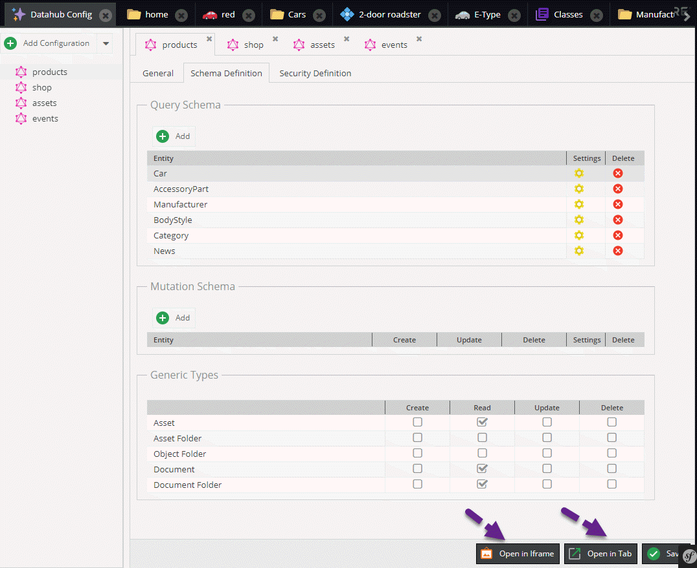

#  GraphQL 


## Short Introduction Video

[](./img/graphql/intro.mp4)

## Samples

* [Get News + Autor + Profile Image](graphl/Sample1.md)
* [Get News Listing](graphl/Sample2.md)
* [Filtered News Listing](graphl/Filtering.md)
* [Many-to-Many Object Relation](graphl/Sample6.md)
* [Advanced Many-to-Many Relation Metadata](graphl/Sample4.md)
* [Get Asset Directly](graphl/Sample3.md)
* [Get Asset Metadata](graphl/Sample5.md)
* [Advanced Many-to-Many Object Relation + Metadata](graphl/Sample7.md)
* [Website Translator](graphl/Sample8.md)

## Configuration

* [General Settings](./graphl/General.md)
* [Schema Definition](./graphl/Schema.md)
* [Security Settings](./graphl/Security.md)


## Customizing the endpoint

The standard endpoint is
```
/pimcore-graphql-webservices/{clientname}?apikey={yourApiKey}
```


```
# app/config/routing.yml

admin_pimcoredatahub_config:
    path: /pimcore-datahub-webservices-my-endpoint/explorer/{clientname}
    defaults: { _controller: PimcoreDataHubBundle:GraphQLExplorer:explorer }

admin_pimcoredatahub_webservice:
  path: /pimcore-graphql-webservices-my-endpoint/{clientname}
  defaults: { _controller: PimcoreDataHubBundle:Webservice:webonyx }
```

## Supported datatypes

Also check out the Pimcore's [data type documentation](https://pimcore.com/docs/5.x/Development_Documentation/Objects/Object_Classes/Data_Types/index.html). 

* Advanced Many-to-Many Relation
* Advanced Many-to-Many Object Relation
* Checkbox
* Country
* Countries (Multiselect)
* Date
* DateTime
* Email
* External Image
* Gender
* Firstname
* Geopoint
* Image
* Input
* Language
* Languages (Multiselect)
* Lastname
* Link
* Many-to-One Relation
* Many-to-Many Relation
* Many-to-Many Object Relation
* Multiselect
* Newsletter Active
* Newsletter Confirmed
* Numeric
* Rgba color
* Select
* Slider
* Textarea
* Wysisyg

## Operators

Check out the [Operators](graphl/Operators.md) page for more info.

* Asset Thumbnail
* Concatenator
* Date Formatter
* Element Counter
* Merge
* Substring
* Static Text
* Trimmer

## Get Object

Also see the samples listed above.

```
{
  getNews(id: 4) {
  ...
  }
} 
    
```

## Listings

* Restrict to object IDs

```
{
  getNewsListing(ids: "4,5") {
    edges {
    ...
```

## Localization

See the [Localization Page](graphl/Localization.md) to learn more.
 
 
## Pagination

Example:
see [Get News Listing](graphl/Sample2.md)

## Simple Sorting
```
{  getNewsListing(sortBy:"title", sortOrder:"ASC") {
    edges {
      node {
```

## Filtering

You can use Pimcore's webservice filter logic
as described [here](https://pimcore.com/docs/5.x/Development_Documentation/Web_Services/Query_Filters.html).

See Example: [Filtered News Listing](graphl/Filtering.md)

## Endpoint + Hands-on-testing using iExplorer


