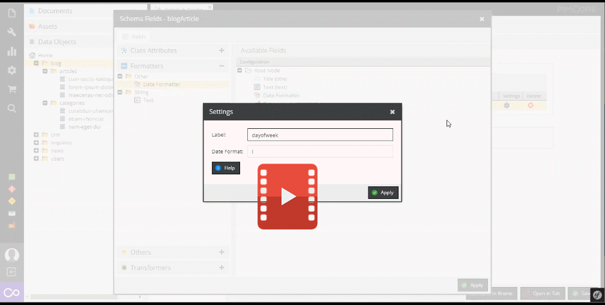

#  GraphQL 


## Short Introduction Video

[](./img/graphql/intro.mp4)

## Query Samples

* [Get News + Autor + Profile Image](graphl/querysamples/Sample1.md)
* [Get News Listing](graphl/querysamples/Sample2.md)
* [Filtered News Listing](graphl/Filtering.md )
* [Many-to-Many Object Relation](graphl/querysamples/Sample6.md)
* [Advanced Many-to-Many Relation Metadata](graphl/querysamples/Sample4.md)
* [Get Asset Directly](graphl/querysamples/Sample3.md)
* [Get Asset Metadata](graphl/querysamples/Sample5.md)
* [Advanced Many-to-Many Object Relation + Metadata](graphl/querysamples/Sample7.md)
* [Website Translator](graphl/querysamples/Sample8.md)

## Mutation Samples
* see [Mutation main page](graphl/Mutations.md)

## Configuration

* [General Settings](./graphl/General.md)
* [Schema Definition](./graphl/Schema.md)
* [Security Settings](./graphl/Security.md)


## Customizing the endpoint

The standard endpoint is
```
/pimcore-graphql-webservices/{configurationname}?apikey={yourApiKey}
```

So if your configuration name is _blogdemo_ and your apikey _123456_
then your endpoint would be

```
/pimcore-graphql-webservices/blogdemo?apikey=12345
```

Here is a configuration example showing how to override the standard endpoint:

```yml
# app/config/routing.yml

admin_pimcoredatahub_config:
    path: /pimcore-datahub-webservices-my-endpoint/explorer/{clientname}
    defaults: { _controller: PimcoreDataHubBundle:GraphQLExplorer:explorer }

admin_pimcoredatahub_webservice:
  path: /pimcore-graphql-webservices-my-endpoint/{clientname}
  defaults: { _controller: PimcoreDataHubBundle:Webservice:webonyx }
```
## Queries

See [Query Documentation](./graphl/Queries.md)

## Mutations

See [Mutation Documentation](./graphl/Mutations.md)

## Endpoint + Hands-on-testing using iExplorer


## Configuration & Deployment

The configuration file can be found `var/config/datahub-configurations.php`.

As a workspace permission index is kept in the database as well you have to run the `datahub:graphql:rebuild-definitions` 
to rebuild the index.

Either call 

```bash
datahub:graphql:rebuild-definitions
``` 

to do that for all definitions, or

```bash
datahub:graphql:rebuild-definitions --definitions=newsapp,otherendpoint
```

for specific definitions.

## Events

See [Events Documentation](./graphl/Events.md)
