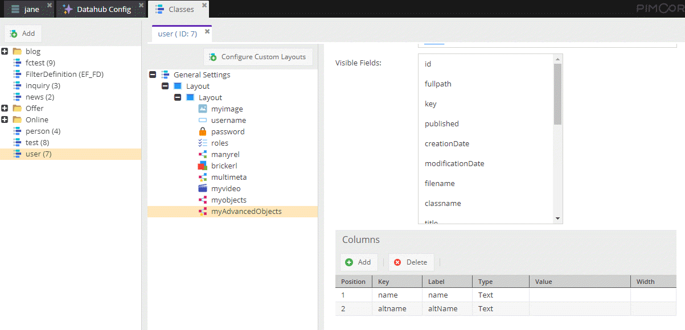

## Advanced Many-to-Many Object Relation + Metadata

>TODO: Align this with the new demo as soon as reasonable content is available. 

Data Model:



Data:


### Request

Note that the response differs from `Advanced Many-to-Many Relations` as there can be only class.

```
{
  getUser(id: 50, defaultLanguage: "en") {
    myAdvancedObjects {
      element {
        id
        classname
        title,
        deTitle: title(language: "de"),
        shortText(language: "de")
      }
      metadata {
        name
        value
      }
    }
  }
}
```

### Response

Here you also see the use of aliases.

```
{
  "data": {
    "getUser": {
      "myAdvancedObjects": [
        {
          "element": {
            "id": "8",
            "classname": "news",
            "title": "In enim justo",
            "deTitle": "Li Europan lingues es membres",
            "shortText": "Lor separat existentie es un myth. Por scientie, musica, sport etc, litot Europa usa li sam vocabular."
          },
          "metadata": [
            {
              "name": "altname",
              "value": "Ratman"
            },
            {
              "name": "name",
              "value": "Canine"
            }
          ]
        },
        {
          "element": {
            "id": "3",
            "classname": "news",
            "title": "Lorem ipsum dolor sit amet",
            "deTitle": "Er hörte leise Schritte hinter sich",
            "shortText": "Das bedeutete nichts Gutes. Wer würde ihm schon folgen, spät in der Nacht und dazu noch in dieser engen Gasse mitten im übel beleumundeten Hafenviertel?"
          },
          "metadata": [
            {
              "name": "altname",
              "value": "Spike"
            },
            {
              "name": "name",
              "value": "Doctor"
            }
          ]
        }
      ]
    }
  }
}
```


